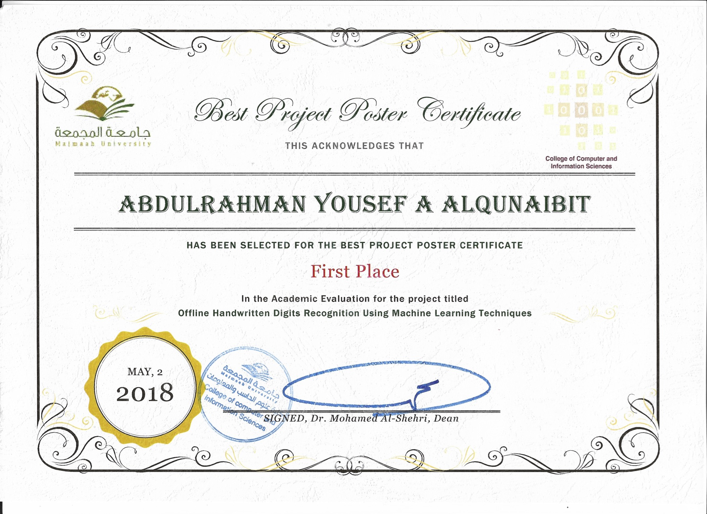

# MyGraduationProject

<h3>ّIn this project i will display how will acquisition the image and what the process in pre-processing phase. After that, when it finished the pre-processing phase will go to segment the image and this is the most important process. After the segmentation operation it need the feature extraction to retrieve the important data of characters help for a good recognition accuracy. Finally, It will display how the classification and recognition operation by Artificial Neural Network(ANN).
</h3> 

